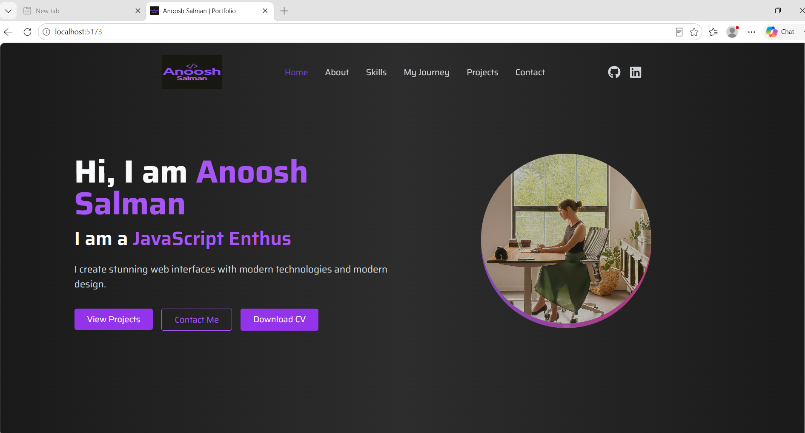
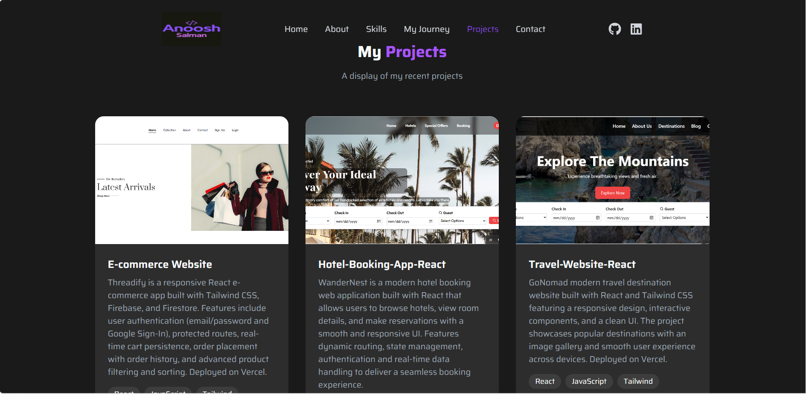
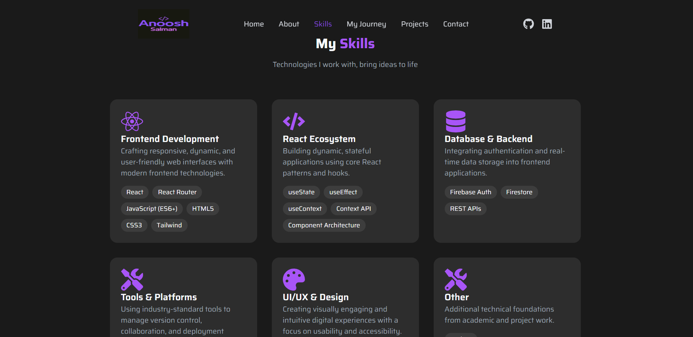

# Anoosh Salman | Portfolio Website

A multi-page personal portfolio website built with React and Framer Motion. Designed to showcase my projects, skills, and journey as a frontend developer.

## Live Demo
[portfolio-website-react-zeta-six.vercel.app](https://portfolio-website-react-zeta-six.vercel.app)

## Github
[github.com/anooshsalman10/portfolio-website-react](https://github.com/anooshsalman10/portfolio-website-react)

## Features
- Multi-page architecture with React Router
- Smooth page and scroll animations with Framer Motion
- Fully responsive design across all screen sizes
- Projects showcase with live demo and GitHub links
- Timeline-based experience and education section
- Contact section

## Tech Stack
React, React Router, Tailwind CSS, Framer Motion, React Icons

## Screenshots

## Pages
- Home
- About
- Skills
- My Journey
- Projects
- Contact